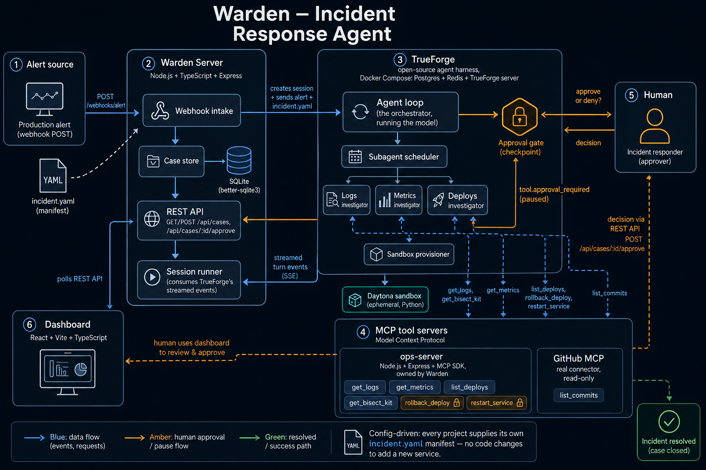

# Warden

Warden is an incident-response agent. Given a production alert, it investigates read-only signals (logs, metrics, recent deploys) through parallel subagents, reproduces the suspected root cause by running real code in an isolated sandbox, and proposes a fix, then stops and waits for a human before doing anything irreversible. Once approved, it acts and verifies recovery before closing the case.

Everything project-specific (where a service's logs and metrics live, what's safe to do automatically versus what needs a human, how to roll it back) lives in a small YAML manifest per project, not in code. Point Warden at a different service by writing a new manifest, not by changing the agent.

## Why an agent, not a chatbot

A chatbot can describe how to debug an incident. Warden does the investigation: it pulls real data from your observability and deploy-history tools, runs a reproduction script in a sandbox to prove a cause instead of guessing one, and only pauses for a person at the one point that actually matters: right before an irreversible change to production. Read-only work happens automatically; a rollback or restart always waits for approval.

## How it's built

Warden runs on [TrueForge](https://github.com/truefoundry/trueforge), an open-source agent harness. TrueForge is what turns the underlying model into something that can act: it runs the agent loop, connects to real tools over MCP, provisions an isolated sandbox on demand, spawns and coordinates subagents, and enforces the human-approval pause before a destructive tool call, all before any of this project's own code runs. Warden's own code is deliberately small: a domain-specific MCP server, a project manifest format, the agent's instructions, and a thin server that turns a webhook alert into a tracked case.



```
demo alert  →  server/  →  TrueForge (agent loop, subagents, sandbox, approval)
                              │
                              ├── mcp/ops-server   (logs, metrics, deploys, bisect kit, rollback)
                              └── github MCP        (real commit history)
                              │
                         case-store (SQLite)  →  dashboard/ (optional)
```

- **`agents/`**: the orchestrator agent's manifest: model, instructions, connectors, sandbox config.
- **`shared/`**: the `incident.yaml` manifest schema and types shared across packages.
- **`mcp/ops-server`**: a small MCP server exposing a project's logs, metrics, deploy history, and a sandboxed bisect kit. Built to be swappable: point a real Grafana/Datadog/Loki MCP server at the same tool contract later with no agent-side changes.
- **`server/`**: webhook intake, a case-store (SQLite), and the REST API the dashboard uses. Turns an alert into a tracked case and drives it through TrueForge's turn stream.
- **`dashboard/`**: an optional web UI (case list, timeline, approve/deny). The whole system works headlessly without it. Send an alert, watch the case progress via the REST API or curl, approve via curl. TrueForge's own bundled chat UI can also drive and inspect any session directly.
- **`skills/`**: reusable instruction packs (bisect methodology, rollback procedure) TrueForge loads on demand.
- **`demo/`**: a self-contained, deletable test project (`sample-checkout`) used to develop and demo the above. Nothing outside `demo/` depends on it; delete it and Warden still runs against a real project you point it at.

## Prerequisites

- Node.js 22+
- Docker (TrueForge's own standalone mode has a known issue on native Windows, see [truefoundry/trueforge](https://github.com/truefoundry/trueforge); Docker Compose sidesteps it and is what this project is built against)
- A [Daytona](https://www.daytona.io/) API key (the sandbox provider TrueForge uses)
- An API key for a model provider TrueForge supports (Anthropic, OpenAI, Gemini, etc.). Free tiers are often rate- or quota-limited well below what one investigation needs, see Troubleshooting below before assuming a failed run means something's broken.

## Setup

**1. Run TrueForge.**

```bash
git clone https://github.com/truefoundry/trueforge.git ../trueforge-runtime
cd ../trueforge-runtime
cp packages/trueforge/.env.example packages/trueforge/.env
# edit packages/trueforge/.env: uncomment HOST=0.0.0.0
docker compose up -d --build
```

Open `http://localhost:8791`. In **Settings**, add a model provider, add a Daytona sandbox provider, and add a GitHub connector (Settings → Connectors → github; needs a token with at least read access, a classic PAT with `public_repo` scope is enough).

`cd` back to this repo's root before continuing.

**2. Install dependencies and configure env vars.**

```bash
npm install
cp .env.example .env
```

The defaults in `.env.example` already match the demo project (`sample-checkout`) and the local ports used below, so nothing needs editing to run the demo. The one value worth checking is `AGENT_MODEL`: it must match the model provider you actually added in TrueForge's Settings in step 1, or agent registration in step 4 will register a model TrueForge can't reach.

**3. Build and run `ops-mcp` and `server`** (both need Docker on Windows, see the Dockerfiles in `mcp/ops-server/` and `server/`; native `npm run dev` works directly on macOS/Linux):

```bash
docker build -f mcp/ops-server/Dockerfile -t warden-ops-mcp .
docker run -d --name warden-ops-mcp --network trueforge_default -p 4000:4000 \
  -e OPS_MCP_ALLOWED_HOSTS="localhost,127.0.0.1,warden-ops-mcp" warden-ops-mcp

docker build -f server/Dockerfile -t warden-server .
docker run -d --name warden-server --network trueforge_default -p 4100:4100 \
  -e TRUEFORGE_BASE_URL="http://trueforge-server-1:8790" \
  -e OPS_MCP_ADMIN_URL="http://warden-ops-mcp:4000" warden-server
```

In TrueForge's Settings → Connectors, add `ops-server` as a remote MCP server at `http://warden-ops-mcp:4000/mcp`.

**4. Register the agent:**

```bash
npm run register-agent
```

**5. Send a test alert:**

```bash
npm run send-alert
```

(defaults to `http://localhost:4100` already; only set `SERVER_BASE_URL` if your server runs elsewhere, and note PowerShell needs `$env:SERVER_BASE_URL="..."` rather than the bash `VAR=value command` form.)

Watch it progress: `curl http://localhost:4100/api/cases`. When a case reaches `awaiting_approval`, review it and approve or deny:

```bash
curl -X POST http://localhost:4100/api/cases/<id>/approve -H "Content-Type: application/json" -d '{"decided_by":"you"}'
```

**What a healthy run looks like:** status moves `investigating` → `awaiting_approval` (the case's `events` array fills in with investigation/evidence/proposed_action entries as the agent works) → after you approve, `executing` → `verifying` → `resolved`, ending with a `result` event stating the metric's before/after numbers. If a case instead lands on `failed`, see Troubleshooting below before assuming something's broken with the setup.

**6. (Optional) Run the dashboard:**

```bash
npm run dev:dashboard
```

Open `http://localhost:5173`.

## Testing

```bash
npm test
```

Runs manifest validation, case-store, ops-mcp handler, session-runner, and bisect-harness tests. On Windows, `better-sqlite3` has no prebuilt binary for very new Node versions yet; run tests inside the `server` Docker image if `npm test` fails locally to build it:

```bash
docker build -f server/Dockerfile -t warden-server .
docker run --rm warden-server sh -c "cd /app && npx vitest run"
```

## Troubleshooting

- **A case ends up `failed` with no obvious cause.** Check TrueForge's own logs first: `docker logs trueforge-server-1 --tail 100`. The most common real cause is the model provider's free-tier quota, not a bug: a single investigation can involve 15+ model calls (three parallel subagents, sandbox correlation, the approval pause and resume, and each verification poll), and some free tiers cap as low as ~20 requests *per day* per project, not per minute, so retrying immediately won't help. If the logs show a `429` / `RESOURCE_EXHAUSTED` error, get a fresh API key on a new provider project (fastest) or enable billing (inexpensive at this scale for flash-tier models).
- **`ops-server` or `github` tools aren't visible to the agent.** Confirm both are added as connectors in TrueForge's Settings → Connectors, not just referenced in `agents/incident-responder.agent.json`: the agent manifest only names them, it doesn't create the connection.
- **Containers can't reach each other by hostname.** `warden-ops-mcp` and `warden-server` both need `--network trueforge_default`, the network TrueForge's own `docker-compose.yml` creates (it names the Compose project `trueforge` explicitly, so this network name is stable regardless of what you named the folder you cloned it into).
- **`npm test` fails locally on Windows** with a `better-sqlite3` build error: expected, see Testing above, run tests inside the `server` Docker image instead.
- **Dashboard shows a CORS error in the browser console.** Shouldn't happen (the server sends permissive CORS headers by default); if it does, confirm `VITE_SERVER_BASE_URL` actually points at the `warden-server` you have running.

## Code review

Every pull request against this repo goes through [Qodo Merge](https://www.qodo.ai/products/qodo-merge/), installed as a GitHub App on this repo. Its review focus is scoped in `.pr_agent.toml` to this project's actual invariant: flag anything that weakens the approval gate around `rollback_deploy` / `restart_service`, or that touches `sessionRunner.ts`, `mcp/ops-server`, or the manifest schema without a matching test. See [#2](https://github.com/Piyush-Piyush/Warden/pull/2) for an example. To enable it on a fork, sign in at Qodo and install the GitHub App on your own copy of the repo.

## Adding a real project

Warden isn't tied to `sample-checkout`; `demo/` is fixture data end to end, meant to be deleted once you don't need it. The extensibility surface is `incident.yaml` plus real MCP connections, not code.

**1. Write the manifest.** Create `projects/<your-service>/incident.yaml` (a new top-level `projects/` folder, kept separate from the deletable `demo/`), using `demo/sample-checkout/incident.yaml` as a reference for the shape (validated by `shared/src/manifest.ts`). At minimum you need:
   - `services[].slo`: what "healthy" means for this service.
   - `signals.metrics` / `signals.logs` / `signals.deploys`: for each, the exact MCP connector name and tool name your real observability/deploy system exposes.
   - `actions.safe` / `actions.approval_required`: which of those tools are read-only versus which need a human.
   - `rollback`: the tool that actually reverts a deploy for your service. This is real, destructive, production-facing code the agent will call, so build and test it independently of Warden first.
   - `verification`: the metric and threshold that mean "recovered."

**2. Tool names must match exactly.** The agent never hardcodes a tool name; its instructions say "call the manifest's metrics tool" and read the literal name out of your `incident.yaml` text at runtime. So `signals.metrics.tool: fetch_metric` only works if a tool literally named `fetch_metric` is both exposed by a real MCP server and enabled for the agent in TrueForge. There's no alias or mapping step; get the string wrong and the call either doesn't fire or fires on nothing.

**3. Connect your real MCP server(s).** In TrueForge's Settings → Connectors, add whatever MCP server(s) your `incident.yaml` references: a vendor-provided one (many observability tools now ship their own MCP server), or one you write yourself, using `mcp/ops-server`'s tool contract as a reference. You almost certainly don't need `ops-server` itself for a real project; it exists to fake data for the demo.

**4. Add a `mcp_servers` entry** in `agents/incident-responder.agent.json` for any new connector name (e.g. `acme-ops`), alongside the existing `ops-server` / `github` entries, listing the tools you want the agent to see.

**5. Get `PROJECTS_DIR` to the running server.** `server/`'s Dockerfile bakes the repo into the image at build time (`COPY . .`); it is not a live volume mount, so a new `projects/` folder needs one of these:
   - **Rebuild and restart the container** (simplest if the manifest lives inside this repo):
     ```bash
     docker build -f server/Dockerfile -t warden-server .
     docker rm -f warden-server
     docker run -d --name warden-server --network trueforge_default -p 4100:4100 \
       -e TRUEFORGE_BASE_URL="http://trueforge-server-1:8790" \
       -e OPS_MCP_ADMIN_URL="http://warden-ops-mcp:4000" \
       -e PROJECTS_DIR="projects" \
       -e DEFAULT_PROJECT="<your-service>" \
       warden-server
     ```
   - **Mount it instead**, if you'd rather keep a real client's manifest out of this repo entirely: add `-v /absolute/path/to/your-project:/app/projects/<your-service>` to the `docker run` above.
   - Running natively on macOS/Linux (`npm run dev -w server`) skips all of this; it reads `PROJECTS_DIR` straight from `.env`.

**6. Register the agent for this project.** Either set `DEFAULT_PROJECT=<your-service>` in `.env` and run `npm run register-agent`, or inline it (bash: `DEFAULT_PROJECT=<your-service> npm run register-agent`; PowerShell: `$env:DEFAULT_PROJECT="<your-service>"; npm run register-agent`).

   This bakes `actions.approval_required` from this project's `incident.yaml` into TrueForge's `require_approval_for_tools` for the agent named `AGENT_NAME`. One real limitation worth knowing: this is per-agent-registration, not per-request. If you're running multiple projects at once with genuinely different approval policies, register each under its own `AGENT_NAME` rather than sharing one.

**7. Send a real alert:**
   ```bash
   npm run send-alert <your-service> <service-name>
   ```

No changes to `mcp/ops-server`'s code or `server/`'s code are needed for any of this; the manifest and MCP connections are the entire extensibility surface.

## License

[MIT](LICENSE)
